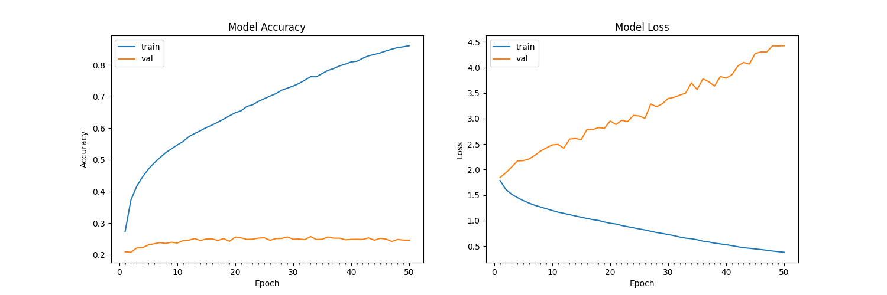

# Sentiment Analysis using Python

---
<br>

## Introduction

This project aims to classify the emotion on a person's face into one of **seven categories**, using deep convolutional neural networks. The model is trained on the **FER-2013** dataset which was published on International Conference on Machine Learning (ICML). This dataset consists of 35887 grayscale, 48x48 sized face images with **seven emotions** - angry, disgusted, fearful, happy, neutral, sad and surprised.  

This repository holds the source code for the Minor project made for the 4th Semester of BE-CSE(IoT).  
  
<br>

---
<br>

## Dependencies

* Python 3.8, [OpenCV](https://opencv.org/), [Tensorflow](https://www.tensorflow.org/)
* To install the required packages, run (after cloning the repo)

```bash
pip install -r requirements.txt
```

---
<br>


## Basic Usage

The project is currently compatible with `tensorflow-2.0` and makes use of the Keras API using the `tensorflow.keras` library.

* First, clone the repository and enter the folder

```bash
git clone https://github.com/TheFenrisLycaon/Sentiment-Analysis.git
cd Sentiment-Analysis
```

* The Dataset should palced inside a directory named ```Data```.  
* If you don't have the dataset already, Download the ```FER-2013``` CSV from from [here](https://drive.google.com/file/d/1X60B-uR3NtqPd4oosdotpbDgy8KOfUdr/view?usp=sharing) and place it under ```Data``` after unzipping.  

* Then run ::  

```bash
python src/dataGen.py
```

* To train this model, use:  

```bash
python src/train.py
```

**NOTE** :: The model is already trained and the binary is placed inside the ```bin``` folder. Retraining the model will overwrite this binary. You may want to do this in case you want to get more/less accuracy by tweaking the epoch levels.

* If you want to view the predictions without training again, you can simply run:  

```bash
python src/main.py
```

* To capture the frame at any point press `SPACEBAR`. The image will be saved in `logs`.
* Press `ESC` to exit.

<br>

---
<br>

* The final folder structure is of the form:  

```txt
|
|__ bin
|       |__ emotion.h5
|   
|__ Data
|       |__ test
|       |       |__ Emotion1  
|       |           |__ img_1.png 
|       |           |__ img_2.png
|       |           |__ img_3.png 
|       |           |...  
|       |       |__ Emotion_2  
|       |           |__ img_1.png
|       |           |__ img_2.png
|       |           |__ img_3.png
|       |           |...  
|       |       |...  
|       |__ train
|       |       |__ Emotion1  
|       |           |__ img_1.png
|       |           |__ img_2.png  
|       |           |__ img_3.png  
|       |           |...  
|       |       |__ Emotion_2  
|       |           |__ img_1.png
|       |           |__ img_2.png
|       |           |__ img_3.png
|       |           |...  
|       |           |... 
|       |__ fer2013.csv
|   
|__  src
|       |__ dataGen.py
|       |__ main.py
|       |__ train.py
|       |__ utils.py
|       |__ haarcascade_frontalface_default.xml.xml
|   
|__ requirements.txt
```

<br>

---
<br>

* This implementation by default detects emotions on all faces in the webcam feed. With a simple 4-layer CNN, the test accuracy reached 63.2% in 50 epochs.  

<br>



<br>

---
<br>

## Algorithm

* First, the `.xml` file is used to detect faces in each frame of the webcam feed.

* The region of image containing the face is resized to **48x48** and is passed as input to the CNN.

* The network outputs a list of **softmax scores** for the seven classes of emotions.

* The emotion with maximum score is displayed on the screen.  

<br>

---
<br>

## Example

[You can see the examples here](examples.md)
