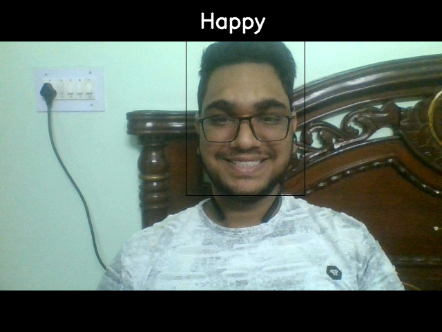

# Example (Demonstration)

## Solo

If you followed all teh steps correctly, you should see someting like this (ofc the faces would change).

 

---
 

## Group

TODO :: [ADD IMAGES](https://www.github.com/TheFenrisLycaon/Sentiment-Analysis/issues/#1)

 

---
 

## Video

TODO :: [ADD VIDEO](https://www.github.com/TheFenrisLycaon/Sentiment-Analysis/issues/#1)

[Return Home](README.md)
