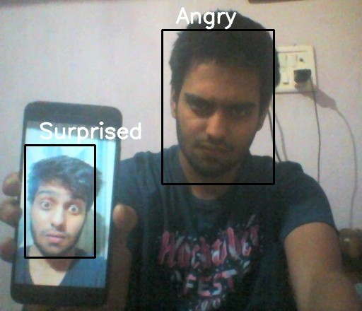
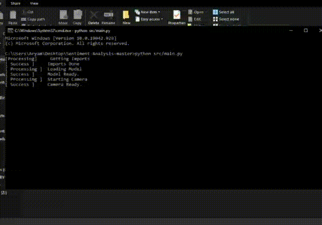

# Example (Demonstration)

## Solo

If you followed all teh steps correctly, you should see someting like this (ofc the faces would change).

 

---
 

## Group

 

---
 

## Video

[Return Home](README.md)
